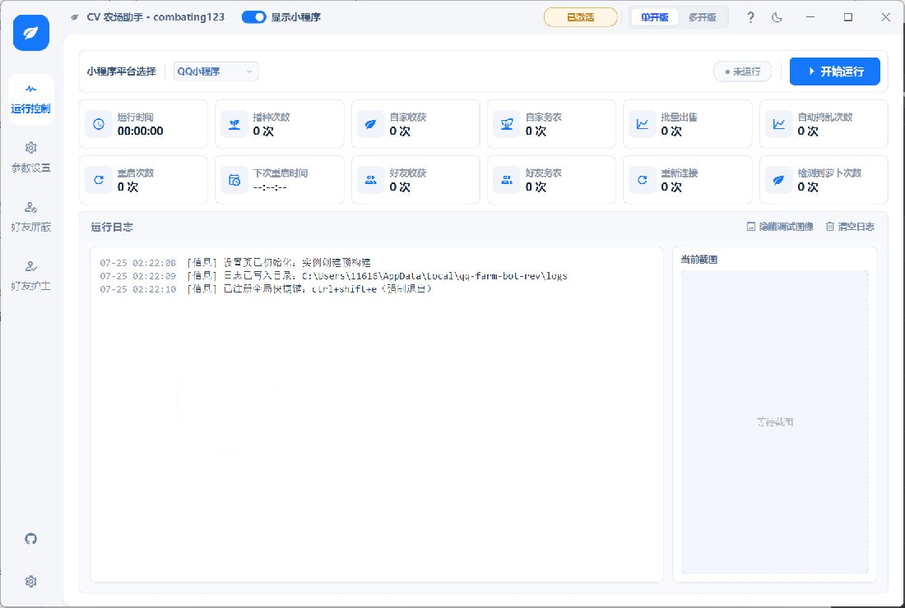

<div align="center">
  

  <br>

  [](#运行环境)
  [](#便携目录)
  [](https://github.com/combating123)

  **QQ / 微信经典农场场景的 Windows 视觉自动化助手。**<br>
  主程序、运行依赖和历史设置集中在一个目录中，解压后从统一入口启动。
</div>

## 真实界面

<p align="center">
  
</p>

> 当前构建保留应用原生浅色布局与控件尺寸，只进行必要的个人信息精简，避免全局主题覆盖造成按钮截断、导航省略或状态栏错位。

## 核心特性

- 在 **QQ 小程序 / 微信小程序** 场景间切换。
- 使用单开或多开模式管理自动化任务。
- 配置播种、收获、浇水、除草、除虫、施肥等视觉流程。
- 处理好友农场巡检、屏蔽与护主流程。
- 使用 `UserData` 保留并同步历史设置与统计数据。
- 启动时自动处理残留的旧实例，避免双击入口后没有反应。
- 应用内 GitHub 入口仅指向 [combating123](https://github.com/combating123)。

## 快速开始

1. 前往仓库的 [Releases](https://github.com/combating123/qq-farm-cv-helper-portable/releases) 下载 `CV-Farm-Studio-Portable.zip`。
2. 将压缩包完整解压到普通目录，例如 `E:\CV农场助手`。
3. 双击 `启动_QQ经典农场助手.cmd`。
4. 在“参数设置”中检查迁移后的配置，再开始运行。

> 请先完整解压，不要直接在压缩包内启动。移动目录后，需要重新创建桌面快捷方式。

## 便携目录

```text
CV农场助手/
├─ QQFarmCVHelper.exe              # 主程序
├─ 启动_QQ经典农场助手.cmd         # 推荐启动入口
├─ launcher.ps1                    # 数据同步、旧实例处理与启动逻辑
├─ UserData/                       # 历史设置和统计数据
│  ├─ legacy-qq-farm-bot-rev/
│  └─ QQFarmCopilot/
├─ ui_personalization.py           # combating123 信息精简
└─ logs/                           # 本地运行日志，不写入交付 ZIP
```

启动器会在运行前后按修改时间同步便携数据与当前 Windows 用户配置目录，并跳过日志、缓存、截图和临时文件。

## 数据同步流程


- 已有文件以较新的修改时间为准。
- `logs`、`cache`、`screenshots`、`captures` 等运行产物不参与迁移。
- 更新程序前建议备份整个 `UserData` 文件夹。

## 界面与项目信息

为保证稳定性，本构建不再覆盖应用的全局 QSS、控件尺寸、侧栏宽度或按钮内边距：

- 标题栏显示 `CV 农场助手 · combating123`。
- 会员状态使用短文案 `已激活`，保持原生状态栏宽度。
- 导航、模式按钮、统计卡片和弹窗继续使用应用原生布局。
- 隐藏界面中的版本标签。
- “项目信息”页只保留项目所有者和 GitHub 主页。
- GitHub 图标只打开 `github.com/combating123`。

## 运行环境

- Windows 10 / Windows 11
- QQ 或微信桌面端及对应经典农场小程序
- 建议使用 100%–150% 显示缩放，并保持小程序窗口可见

## 使用提示

- 视觉自动化依赖窗口尺寸、显示缩放与模板匹配；外部窗口布局变化后需要重新检查参数。
- 运行前确认平台选择、窗口位置和自动化开关。
- 出现识别异常时，优先检查 `logs` 和当前截图区域。
- 更新或移动目录前，先复制 `UserData` 作为回滚备份。

## 仓库与发布

本仓库维护 README、界面信息精简文件、便携启动器和 Release 交付包。完整运行依赖仅放入 Release，避免将大型二进制写入 Git 历史。

- GitHub 主页：[combating123](https://github.com/combating123)
- 问题反馈：[Issues](https://github.com/combating123/qq-farm-cv-helper-portable/issues)
- 便携包下载：[Releases](https://github.com/combating123/qq-farm-cv-helper-portable/releases)