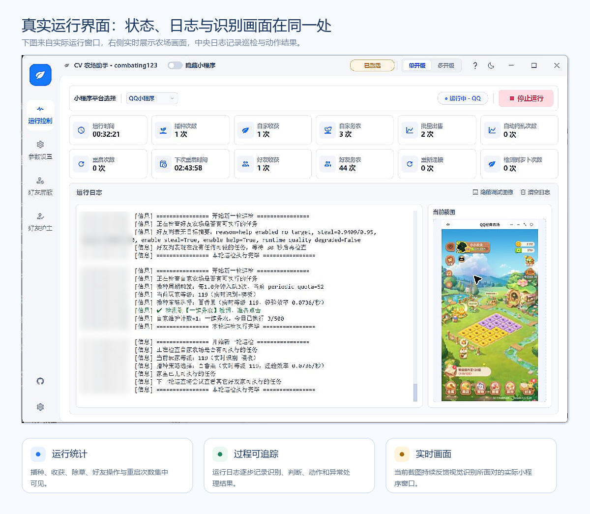
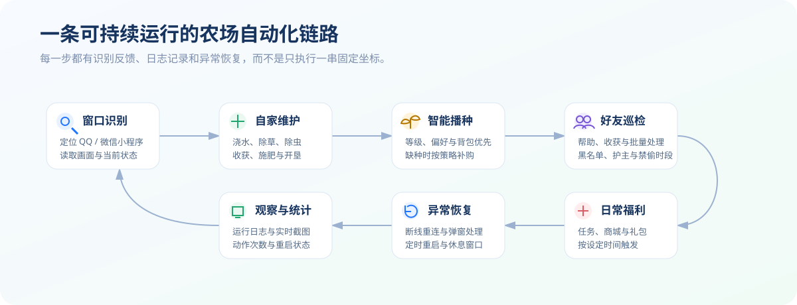
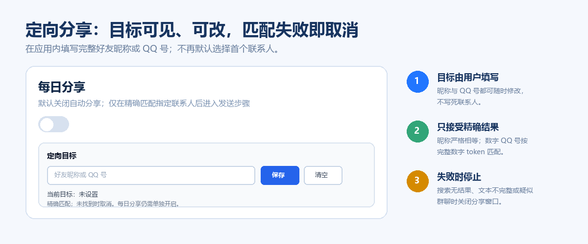
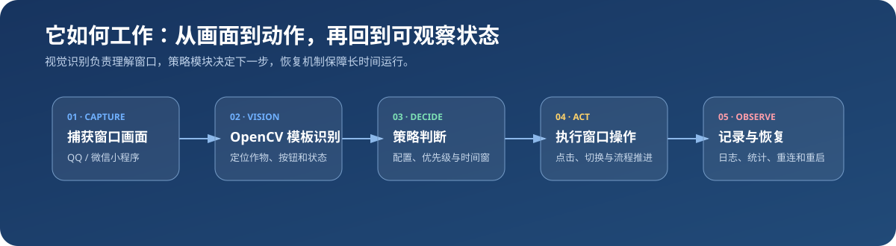
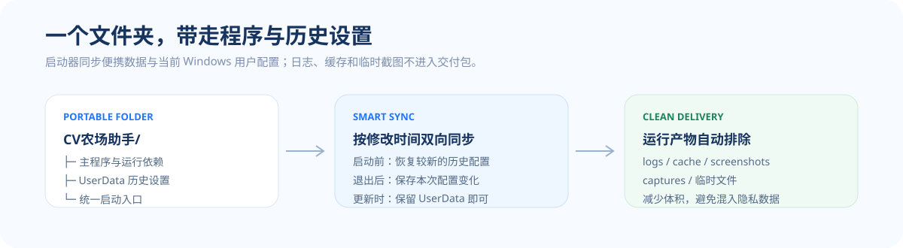

<div align="center">
  

  <br>

  [](#运行要求)
  [](#版本与更新)
  [](#版本与更新)
  [](#平台与多实例)
  [](#视觉自动化流程)
  [](#便携目录与数据保留)

  **把经典农场里的重复操作，整理成可观察、可配置、可恢复的自动工作流。**

  面向 Windows 上的 QQ / 微信经典农场场景，覆盖自家经营、好友巡检、播种策略、日常福利、异常恢复与多实例管理；运行过程同时保留日志、统计和实时识别画面。

  [下载便携包](https://github.com/combating123/qq-farm-cv-helper-portable/releases) · [快速开始](#快速开始) · [常见问题](#常见问题)
</div>

---

## 先看实际运行效果



主界面把长期运行最需要观察的三类信息集中在同一处：

- **运行状态**：运行时长、播种、收获、除草、好友操作、重连和重启次数集中展示。
- **执行过程**：日志逐步记录识别结果、策略判断、动作阶段和异常原因。
- **实时画面**：当前截图持续反馈程序正在识别的窗口和农场画面。

这套布局不仅用于启动自动化，也方便在长时间运行后回看状态、定位识别问题和调整参数。

## 项目亮点



| 能力 | 做什么 | 使用价值 |
| --- | --- | --- |
| 自家农场 | 收获、播种、浇水、除草、除虫、施肥、开垦、出售 | 减少高频重复经营操作 |
| 播种策略 | 等级检测、偏好作物、背包优先、缺种购买、活动种子 | 根据等级和库存选择播种方案 |
| 好友农场 | 巡检、帮助、可收获作物处理、批量操作、黑名单、保护 | 减少逐个访问好友农场的重复流程 |
| 日常流程 | 免费福利、每日任务、商城福利、礼包、自定义时间 | 集中处理分散的日常入口 |
| 定向分享 | 用户填写目标、精确匹配、失败取消、默认关闭 | 避免随机选中联系人或群聊 |
| 稳定运行 | 断线重连、弹窗处理、定时重启、休息窗口、自动拉起 | 应对长时间运行中的连接和窗口异常 |
| 多平台多实例 | QQ / 微信切换、单开、多开、实例配置 | 在同一套界面中管理不同农场窗口 |
| 可观察性 | 日志、实时截图、动作统计、下次重启时间 | 快速理解当前进度和失败原因 |
| 便携数据 | 单目录运行、旧设置迁移、更新保留 `UserData` | 移动或更新时延续已有设置 |

## 定向分享：由用户决定分享给谁



“每日分享”默认保持关闭。需要使用时，在应用界面填写完整好友昵称或 QQ 号并保存，再单独开启每日分享。

### 匹配规则

1. **昵称严格匹配**：去除空白并统一大小写后仍须完整相等，不做模糊昵称匹配。
2. **数字 QQ 号完整匹配**：当 QQ 分享搜索结果的 UI 文本能暴露 QQ 号时，只匹配完整数字 token，不接受数字子串。
3. **排除群聊**：候选项包含群聊或群组特征时不进入发送步骤。
4. **失败即取消**：搜索失败、结果文本不完整、目标不可见或控件坐标异常时关闭分享窗口。
5. **不选择首行兜底**：没有精确目标时，不使用“第一个搜索结果”或“首个联系人”继续发送。

> QQ 客户端界面会随客户端更新而变化。昵称和 QQ 号是否可被识别，取决于分享搜索结果向 Windows UI Automation 暴露的文本；目标未被完整识别时流程会停止。

## 功能详解

### 1. 自家农场自动经营

围绕一次完整的作物周期执行维护：

- 自动识别成熟作物并收获；
- 对缺水、杂草、虫害等状态执行维护；
- 根据等级、库存和偏好选择作物；
- 在背包缺少目标种子时按配置进入购买流程；
- 对空闲土地执行播种，对可用土地执行开垦；
- 按设置处理仓库与出售步骤。

### 2. 好友巡检与帮助

- 好友列表严格从上到下选择第一位符合条件的好友，避免跳过首位；
- 同一好友同时有可偷取作物和“一键务农”时，两项都完成后再继续；
- 通过农场底部好友卡连续访问后续好友，直到遇到首个稳定无任务好友后才回家；
- 护主名单模式会在每次切换好友后重新核对已导入头像模板，资格不会跨好友残留；
- 快速打开好友列表并压缩连续处理等待，减少列表、拜访和点击动作之间的停顿；
- 支持批量入口、巡检上限和间隔控制，并记录当前好友、动作结果和跳过原因。
### 3. 播种策略

- 读取当前等级并过滤不可用作物；
- 支持偏好作物、固定作物和活动种子；
- 优先使用背包已有种子；
- 在缺少种子时按开关决定是否购买；
- 通过识别阈值和等待时间适配不同窗口状态。

### 4. 日常福利与定时任务

- 可配置免费福利、每日任务、商城福利和礼包流程；
- 支持自定义触发时间；
- 每项自动流程都有独立开关；
- “每日分享”附加可编辑的定向目标和严格匹配保护。

### 5. 稳定运行与异常恢复

- 识别目标窗口消失、连接中断或页面异常；
- 对已知弹窗执行关闭或返回；
- 支持定时重启和运行间隔；
- 记录重连、重启和识别失败次数；
- 保留当前截图和日志，便于复盘实际画面。

## 视觉自动化流程



```text
定位 QQ / 微信小程序窗口
          ↓
捕获当前画面并裁剪识别区域
          ↓
模板匹配 / OCR / 颜色与位置判断
          ↓
根据配置和当前状态选择动作
          ↓
点击、等待、再次截图并验证结果
          ↓
写入日志与统计；异常时重试、返回或重连
```

视觉识别依赖真实窗口画面，因此显示缩放、窗口遮挡、主题变化和客户端界面更新都会影响识别结果。项目把阈值、等待时间、功能开关和实例参数集中到配置中，方便按环境调整。

## 平台与多实例

- 支持在应用内选择 QQ 或微信小程序场景；
- 单开模式适合只运行一个农场窗口；
- 多开模式为不同实例维护独立的机器人、自家、好友和播种配置；
- 定向分享目标保存到当前活动实例，不覆盖其他实例的联系人设置。

## 便携目录与数据保留



便携包解压后在同一个目录中运行。启动器负责：

1. 检查主程序、运行库和注入文件；
2. 将历史配置迁移到便携目录；
3. 统一从当前目录启动；
4. 将运行数据保存在 `UserData`；
5. 更新程序文件时保留用户配置、实例数据和必要缓存。

### 重要目录

```text
CV农场助手/
├─ QQFarmCVHelper.exe
├─ QQFarmCVHelper（双击启动）.lnk
├─ StartFarmAssistant.vbs
├─ 启动_QQ经典农场助手.cmd
├─ launcher.ps1
├─ hook.py
├─ ui_personalization.py
├─ share_target_settings.py
├─ UserData/
└─ 项目说明.txt
```

更新时优先保留 `UserData`。首次启动会将既有 Windows 配置和当天任务状态只读迁移到 `UserData\WindowsProfile`；迁移完成后，运行状态、日志、计数和用户配置都留在当前便携目录，启动器不再回写 C 盘原配置。日志目录和临时缓存不需要长期保留，也不进入发布压缩包。

## 快速开始

1. 从 [Releases](https://github.com/combating123/qq-farm-cv-helper-portable/releases) 下载便携包。
2. 解压到可读写的普通目录，避免直接在压缩包内运行。
3. 双击 `QQFarmCVHelper（双击启动）.lnk`；如果目录中没有该快捷方式，双击 `StartFarmAssistant.vbs`。两者都会隐藏 PowerShell 启动窗口。
4. 在应用中选择 QQ 或微信以及单开 / 多开模式。
5. 保持经典农场小程序窗口可见，先使用少量功能验证识别效果。
6. 根据日志与当前截图调整识别阈值、等待时间和自动化开关。
7. 如需每日分享，先填写并保存定向目标，再单独开启分享功能。

## 建议的首次配置顺序

```text
选择平台与实例
  → 确认小程序窗口可见
  → 只开启自家农场基础维护
  → 检查日志与实时截图
  → 配置播种策略
  → 开启好友巡检
  → 最后按需启用日常福利与定向分享
```

分阶段开启功能更容易判断具体是哪个识别步骤需要调整。

## 运行要求

- Windows 10 或 Windows 11；
- QQ 或微信桌面客户端；
- 经典农场小程序窗口保持登录和可见；
- 解压目录具有读写权限；
- 显示缩放和窗口尺寸尽量保持稳定；
- 安全软件如拦截本地运行库加载，需要允许当前便携目录正常运行。

## 常见问题

<details>
<summary><strong>双击启动后没有界面</strong></summary>

- 确认已经完整解压；
- 优先双击 `QQFarmCVHelper（双击启动）.lnk`，没有快捷方式时双击 `StartFarmAssistant.vbs`；
- 检查主程序和运行库是否被安全软件隔离；
- 查看 `logs` 中最近的启动与注入日志；
- 路径过深或含特殊权限限制时，可移动到较短的普通目录重试。
</details>

<details>
<summary><strong>能打开，但按钮、导航或状态栏显示错位</strong></summary>

项目保留应用原生浅色布局和控件尺寸，仅对项目文字和局部功能区做调整。若仍错位，优先检查 Windows 显示缩放、字体放大设置和窗口尺寸。
</details>

<details>
<summary><strong>识别不到农场窗口或动作不稳定</strong></summary>

确认平台选择正确、小程序没有被最小化或遮挡，并观察右侧实时截图是否与实际农场画面一致。不同缩放比例和客户端界面更新可能需要调整阈值与等待时间。
</details>

<details>
<summary><strong>填写昵称或 QQ 号后没有分享</strong></summary>

流程只接受精确匹配。确认输入的是完整昵称或完整 QQ 号；如果 QQ 搜索结果没有向 UI Automation 暴露完整数字，数字匹配会停止。未找到目标时不会改用首个搜索结果。
</details>

<details>
<summary><strong>更新后如何保留原有设置</strong></summary>

保留旧目录中的 `UserData`，再更新其余程序文件。首次迁移完成后，运行配置与每日状态位于 `UserData\WindowsProfile`，更新时不需要重新配置休息时段、好友巡视、施肥、播种或每日任务开关。
</details>

## 版本与更新

当前本地部署版本为 **v1.4.11**。项目采用独立 Git 标签和 Release 记录每轮公开修改，不再只保留一个无法区分迭代历史的安装包。

| 版本 | 重点变化 | 验证 |
| --- | --- | --- |
| v1.4.11（本地部署） | OCR 暂时失败时继续消费背包种子但禁止按旧等级买种；每日任务状态、配置和运行数据迁移至 `E:` 便携档案；双击快捷方式/VBS 隐藏启动 | 521 项测试 |
| v1.4.10 | 自家空地未清零时持续执行自家维护；稳定空地快照防止单帧误判；好友入口点击后等待真实好友界面确认 | 490 项测试 |
| [v1.4.8](https://github.com/combating123/qq-farm-cv-helper-portable/releases/tag/v1.4.8) | 用户设置字节级保留、自家空地优先种满并施肥、等级末位纠错、分享四项证据闭环与好友链收敛 | 481 项测试 |
| [v1.4.7](https://github.com/combating123/qq-farm-cv-helper-portable/releases/tag/v1.4.7) | 商城每日福利包装幂等、递归异常退避；保留全土地局部 2×2 田字型枚举 | 445 项测试 |
| [v1.4.6](https://github.com/combating123/qq-farm-cv-helper-portable/releases/tag/v1.4.6) | 24 块土地全候选局部田字型枚举、普通种子降级、当前护主卡复核与中间无动作好友继续扫描 | 440 项测试 |
| [v1.4.5](https://github.com/combating123/qq-farm-cv-helper-portable/releases/tag/v1.4.5) | 2×2 特殊种子事务级确认重试；好友底栏被裁剪时仍依据回家按钮与可见偷取/务农入口执行动作 | 432 项测试 |
| [v1.4.4](https://github.com/combating123/qq-farm-cv-helper-portable/releases/tag/v1.4.4) | 好友首行封禁门禁、同好友偷取+务农、连续好友链、空地与背包播种、自动捣乱有界扫描、关于页和稳定性收敛 | 429 项测试 |
| [v1.4.3](https://github.com/combating123/qq-farm-cv-helper-portable/releases/tag/v1.4.3) | 首位好友优先、多好友底部连续处理、逐好友护主复核、快速列表入口与每日任务状态修复 | 316 项测试 |
| [v1.4.2](https://github.com/combating123/qq-farm-cv-helper-portable/releases/tag/v1.4.2) | 护主好友进入后继承资格，立即执行一键务农，消除约 30–40 秒无动作等待 | 300 项测试 |
| [v1.4.1](https://github.com/combating123/qq-farm-cv-helper-portable/releases/tag/v1.4.1) | 定向分享成功状态持久化，精确选择联系人圆点，避免重复发送 | 296 项测试 |
| [v1.4.0](https://github.com/combating123/qq-farm-cv-helper-portable/releases/tag/v1.4.0) | 好友连续处理、护主名单、每日状态、资源限制与 UIA 便携依赖 | 293 项测试 |
| [v1.3.1](https://github.com/combating123/qq-farm-cv-helper-portable/releases/tag/v1.3.1) | 分享目标、运行监督与权益上下文稳定性修复 | 历史稳定点 |
| [v1.3.0](https://github.com/combating123/qq-farm-cv-helper-portable/releases/tag/v1.3.0) | CPU/OCR 限制与好友巡检恢复 | 历史稳定点 |
| [v1.2.0](https://github.com/combating123/qq-farm-cv-helper-portable/releases/tag/v1.2.0) | README、关于页与定向分享设置 | 历史稳定点 |
| [v1.1.0](https://github.com/combating123/qq-farm-cv-helper-portable/releases/tag/v1.1.0) | 单目录合并、旧设置迁移和原生浅色布局 | 历史稳定点 |
| [v1.0.0](https://github.com/combating123/qq-farm-cv-helper-portable/releases/tag/v1.0.0) | 首个便携交付版本 | 历史稳定点 |

完整明细见 [`CHANGELOG.md`](./CHANGELOG.md)。更新时只替换程序文件并保留 `UserData`，即可延续原有实例、好友护主模板和功能设置。
## 仓库内容

本仓库主要维护：

- 面向使用者的项目说明和效果图；
- 便携启动器与数据迁移逻辑；
- 应用内项目文字和定向分享配置；
- Release 便携交付包。

大型运行依赖不写入 Git 历史，完整可运行内容通过 Releases 提供。

## 下载与问题反馈

- [下载便携包](https://github.com/combating123/qq-farm-cv-helper-portable/releases)
- [提交问题](https://github.com/combating123/qq-farm-cv-helper-portable/issues)
- [查看仓库](https://github.com/combating123/qq-farm-cv-helper-portable)

提交识别问题时，建议附上平台、显示缩放、窗口状态、相关日志片段和当前截图，以便定位具体流程。
