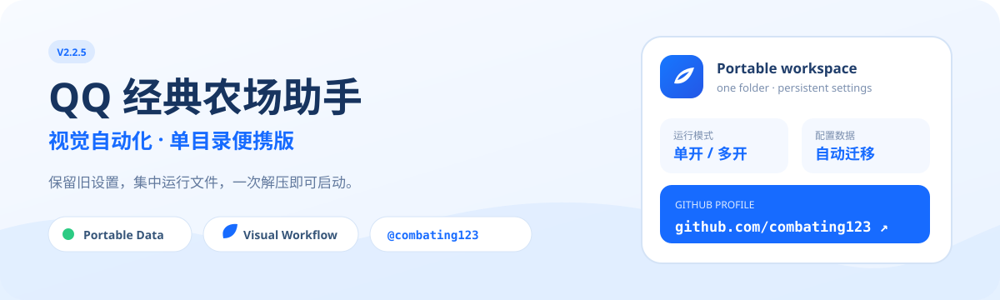
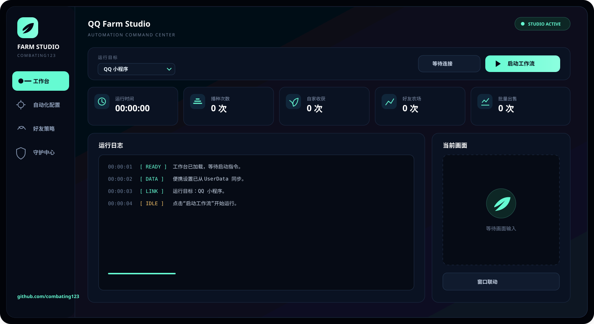
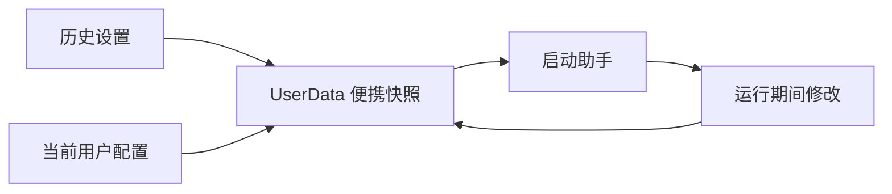

<div align="center">
  

  <br>

  [](#运行环境)
  [](#便携目录)
  [](https://github.com/combating123)

  **QQ / 微信经典农场场景的 Windows 视觉自动化助手。**  
  将程序、运行依赖和历史设置收拢到一个便携目录，解压后即可继续使用。
</div>

## 界面预览

<p align="center">
  
</p>

> 设计预览使用与程序相同的深色令牌与界面文案；实时数据和画面区域会在运行时更新。

## 你可以用它做什么

- 在 **QQ 小程序 / 微信小程序** 场景间切换。
- 使用单实例或多实例模式管理自动化任务。
- 配置播种、收获、浇水、除草、除虫、施肥等视觉流程。
- 处理好友农场巡检、屏蔽和护主相关流程。
- 将历史设置迁移到 `UserData`，移动后继续沿用原有配置。
- 通过单目录便携结构减少重复依赖和重复副本占用。
- 从应用内 GitHub 图标直接进入 [combating123 的主页](https://github.com/combating123)。

## 快速开始

1. 打开[仓库的 **Releases** 页面](https://github.com/combating123/qq-farm-cv-helper-portable/releases)并下载 `CV-Farm-Studio-Portable.zip`。
2. 将压缩包完整解压到普通目录，例如 `E:\CV农场助手`。
3. 双击 `启动_QQ经典农场助手.cmd`。
4. 在“自动化配置”中检查已迁移的配置，再开始运行。

> 不要直接在压缩包内启动。目录移动后，请重新创建桌面快捷方式。

## 便携目录

```text
CV农场助手/
├─ QQFarmCVHelper.exe              # 主程序
├─ 启动_QQ经典农场助手.cmd  # 推荐入口
├─ launcher.ps1                    # 设置同步与启动逻辑
├─ UserData/                       # 便携设置与统计数据
│  ├─ legacy-qq-farm-bot-rev/
│  └─ QQFarmCopilot/
├─ ui_personalization.py           # combating123 界面个性化
└─ logs/                           # 本地运行日志
```

启动器会在运行前后同步便携数据与当前 Windows 用户配置目录，并跳过日志、缓存、截图和临时文件，避免把无用内容写回 `UserData`。

## 设置迁移流程



- 已有文件以较新的修改时间为准。
- `logs`、`cache`、`screenshots`、`captures` 等运行产物不会参与迁移。
- 更新程序前建议备份整个 `UserData` 文件夹。

## 个性化界面

本便携构建将应用内公开身份统一为 **combating123**：

- 左侧 GitHub 图标仅跳转至 `github.com/combating123`。
- “关于”页移除旧项目地址、群聊、文档与更新入口。
- 深色主题在窗口首次显示前安装，避免启动时由浅色瞬间切换。
- 会员状态等动态弹窗统一使用深海军蓝与薄荷青视觉。
- 项目名片页采用深海军蓝与薄荷青布局，仅展示项目名称、所有者与 GitHub 主页。
- 标题栏加入 `combating123` 标识，便于区分个人便携构建。

## 运行环境

- Windows 10 / Windows 11
- QQ 或微信桌面端及对应经典农场小程序
- 建议使用 100%–150% 显示缩放，并保持小程序窗口可见
- 首次运行如被系统拦截，请在 Windows 文件属性中检查下载文件状态

## 使用提示

- 视觉自动化依赖窗口尺寸、缩放比例和模板匹配，界面布局变化后需要重新检查参数。
- 运行前先确认平台选择、窗口位置和自动化开关。
- 出现识别异常时，优先检查日志与当前截图区域。
- 更新或移动目录前，先复制 `UserData` 作为回滚备份。

## 仓库内容

本仓库用于维护 README、界面个性化文件、便携启动器及 Release 交付包。完整运行依赖随 Release 压缩包发布，避免将大型二进制直接写入 Git 历史。

## GitHub

- Owner: [combating123](https://github.com/combating123)
- Issues: 请使用本仓库的 GitHub Issues 记录问题与改进建议
- Releases: 完整便携包与文件校验值发布在本仓库 Releases


